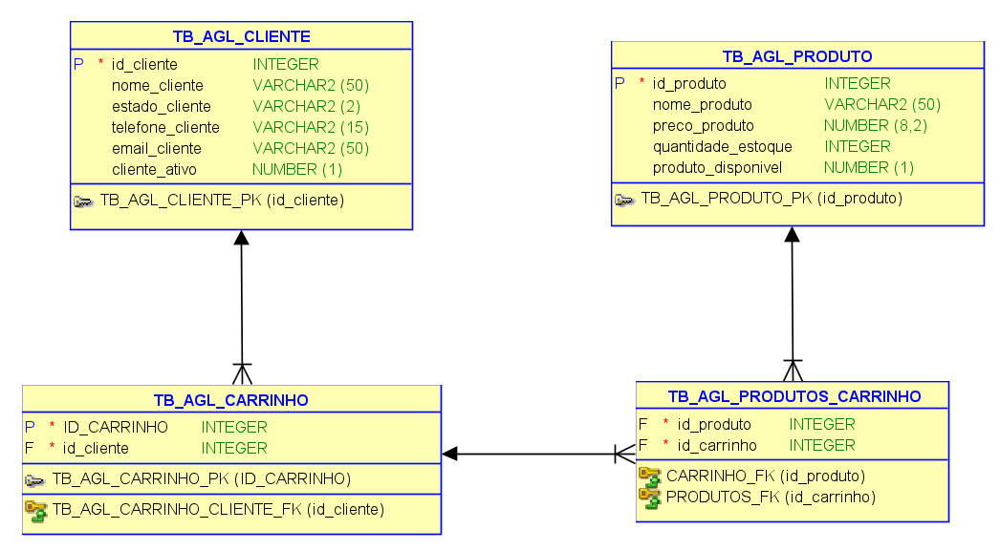

# 🛒 API AGL Marketplace

> API RESTful para gerenciamento de mercado digital, focada em boas práticas de desenvolvimento e alta cobertura de testes.


[](https://github.com/mrpine19/api-agl-marketplace/actions)
[](https://github.com/mrpine19/api-agl-marketplace/actions)

Esta é uma API RESTful desenvolvida em Java com Spring Boot para gerenciar um marketplace (mercado digital). O sistema permite o gerenciamento de clientes, produtos e carrinhos de compras.

## 🚀 Tecnologias Utilizadas

- **Java**
- **Spring Boot** (Web, Data JPA)
- **Hibernate / JPA** (Mapeamento Objeto-Relacional)
- **Banco de Dados Relacional** (Modelagem inicial em Oracle)
- **Lombok** (Para redução de código boilerplate como Getters, Setters, etc.)
- **Maven** (Gerenciamento de dependências e build)

## 🧪 Qualidade e Testes Unitários

O projeto foi construído com uma mentalidade voltada à qualidade, atingindo **98% de cobertura de código**.
- **Frameworks:** JUnit 5 e Mockito.
- **Padrões:** Implementação do padrão *Arrange-Act-Assert*.
- **Automação:** O relatório de cobertura é gerado via **JaCoCo** e um Badge dinâmico é atualizado automaticamente a cada push via GitHub Actions.

## 📦 Estrutura do Projeto

A arquitetura segue o padrão de camadas do Spring para garantir separação de responsabilidades:
- `controllers`: Exposição de Endpoints e tratamento de requisições.
- `services`: Camada de lógica de negócio e orquestração.
- `models`: Entidades de domínio e mapeamento ORM.
- `repository`: Abstração de acesso ao banco de dados.
- `dto`: Objetos de transferência de dados para respostas otimizadas.

## ⚙️ Funcionalidades (Endpoints)

### 👥 Clientes (`/customers`)
- `GET /customers` - Lista todos os clientes.
- `GET /customers/search` - Busca clientes por nome com projection resumida.
- `GET /customers/{id}` - Busca um cliente pelo ID.
- `POST /customers` - Cadastra um novo cliente (Cria automaticamente um carrinho de compras atrelado a ele).
- `PUT /customers/{id}` - Atualiza as informações de um cliente existente.
- `DELETE /customers/{id}` - Deleta um cliente (e seu carrinho de compras em cascata).

### Json de teste para Customer
```json
{
  "nomeCliente": "Neymar Júnior",
  "estadoCliente": "SP",
  "telefoneCliente": "(11) 91234-5678",
  "emailCliente": "neymarjr@santos.com",
  "clienteAtivo": true
}
```

### 🛒 Carrinho de Compras (`/shoppingCart`)
- `GET /shoppingCart` - Lista os carrinhos de compras e seus produtos.
- `PUT /shoppingCart` - Adição de itens ao carrinho.

### 📦 Produtos (`/products`)
- `GET /products` - Lista todos os produtos.
- `GET /products/{id}` - Busca um produto pelo ID.
- `POST /products` - Cadastra um novo produto.
- `PUT /products/{id}` - Atualiza as informações de um produto existente.
- `DELETE /products/{id}` - Realiza o "Soft Delete" de um produto (Muda o status `produtoDisponivel` para inativo, preservando o histórico).

---

## 🗄️ Modelagem do Banco de Dados

### Modelo Relacional



### Script DDL (Criação das Tabelas)

Para testar o projeto localmente, execute o script DDL abaixo em seu banco de dados Oracle para criar as tabelas necessárias.

<details>
  <summary>Clique aqui para visualizar o Script DDL (Oracle)</summary>

```sql
    DROP TABLE TB_AGL_CARRINHO CASCADE CONSTRAINTS
    ;
    
    DROP TABLE TB_AGL_CLIENTE CASCADE CONSTRAINTS
    ;
    
    DROP TABLE TB_AGL_PRODUTO CASCADE CONSTRAINTS
    ;
    
    DROP TABLE TB_AGL_PRODUTOS_CARRINHO CASCADE CONSTRAINTS
    ;
    
    DROP SEQUENCE TB_AGL_CARRINHO_ID_CARRINHO
    ;
    
    DROP SEQUENCE TB_AGL_CLIENTE_id_cliente_SEQ
    ;
    
    DROP SEQUENCE TB_AGL_PRODUTO_id_produto_SEQ
    ;
    
    CREATE SEQUENCE TB_AGL_CARRINHO_ID_CARRINHO
        START WITH 1
        NOCACHE 
        ORDER
    ;
    
    CREATE SEQUENCE TB_AGL_CLIENTE_id_cliente_SEQ
        START WITH 1
        NOCACHE 
        ORDER
    ;
    
    CREATE SEQUENCE TB_AGL_PRODUTO_id_produto_SEQ
        START WITH 1
        NOCACHE 
        ORDER
    ;
    
    CREATE TABLE TB_AGL_CARRINHO
    (
        ID_CARRINHO INTEGER  NOT NULL ,
        id_cliente  INTEGER  NOT NULL
    )
        LOGGING
    ;
    
    ALTER TABLE TB_AGL_CARRINHO
        ADD CONSTRAINT TB_AGL_CARRINHO_PK PRIMARY KEY ( ID_CARRINHO ) ;
    
    CREATE TABLE TB_AGL_CLIENTE
    (
        id_cliente       INTEGER  NOT NULL ,
        nome_cliente     VARCHAR2 (50) ,
        estado_cliente   VARCHAR2 (2) ,
        telefone_cliente VARCHAR2 (15) ,
        email_cliente    VARCHAR2 (50) ,
        cliente_ativo    NUMBER (1)
    )
        LOGGING
    ;
    
    ALTER TABLE TB_AGL_CLIENTE
        ADD CONSTRAINT TB_AGL_CLIENTE_PK PRIMARY KEY ( id_cliente ) ;
    
    CREATE TABLE TB_AGL_PRODUTO
    (
        id_produto         INTEGER  NOT NULL ,
        nome_produto       VARCHAR2 (50) ,
        preco_produto      NUMBER (8,2) ,
        quantidade_estoque INTEGER ,
        produto_disponivel NUMBER (1)
    )
        LOGGING
    ;
    
    ALTER TABLE TB_AGL_PRODUTO
        ADD CONSTRAINT TB_AGL_PRODUTO_PK PRIMARY KEY ( id_produto ) ;
    
    CREATE TABLE TB_AGL_PRODUTOS_CARRINHO
    (
        id_produto  INTEGER  NOT NULL ,
        id_carrinho INTEGER  NOT NULL
    )
        LOGGING
    ;
    
    ALTER TABLE TB_AGL_PRODUTOS_CARRINHO
        ADD CONSTRAINT CARRINHO_FK FOREIGN KEY
            (
             id_produto
                )
            REFERENCES TB_AGL_PRODUTO
                (
                 id_produto
                    )
            NOT DEFERRABLE
    ;
    
    ALTER TABLE TB_AGL_PRODUTOS_CARRINHO
        ADD CONSTRAINT PRODUTOS_FK FOREIGN KEY
            (
             id_carrinho
                )
            REFERENCES TB_AGL_CARRINHO
                (
                 ID_CARRINHO
                    )
            NOT DEFERRABLE
    ;
    
    ALTER TABLE TB_AGL_CARRINHO
        ADD CONSTRAINT TB_AGL_CARRINHO_CLIENTE_FK FOREIGN KEY
            (
             id_cliente
                )
            REFERENCES TB_AGL_CLIENTE
                (
                 id_cliente
                    )
            NOT DEFERRABLE
    ;
    
    CREATE OR REPLACE TRIGGER TB_AGL_CARRINHO_ID_CARRINHO 
    BEFORE INSERT ON TB_AGL_CARRINHO 
    FOR EACH ROW 
    WHEN (NEW.ID_CARRINHO IS NULL)
    BEGIN 
        :NEW.ID_CARRINHO := TB_AGL_CARRINHO_ID_CARRINHO.NEXTVAL;
    END;
    /
    
    CREATE OR REPLACE TRIGGER TB_AGL_CLIENTE_id_cliente_TRG 
    BEFORE INSERT ON TB_AGL_CLIENTE 
    FOR EACH ROW 
    WHEN (NEW.id_cliente IS NULL)
    BEGIN 
        :NEW.id_cliente := TB_AGL_CLIENTE_id_cliente_SEQ.NEXTVAL;
    END;
    /
    
    CREATE OR REPLACE TRIGGER TB_AGL_PRODUTO_id_produto_TRG 
    BEFORE INSERT ON TB_AGL_PRODUTO 
    FOR EACH ROW 
    WHEN (NEW.id_produto IS NULL)
    BEGIN 
        :NEW.id_produto := TB_AGL_PRODUTO_id_produto_SEQ.NEXTVAL;
    END;
    /
```
</details>

## 🛠️ Como Executar o Projeto

1. Certifique-se de ter o **Java (JDK)** e o **Maven** instalados em sua máquina.
2. Clone este repositório.
3. Configure as credenciais do seu banco de dados no arquivo `application.properties` localizado em `src/main/resources`.
4. Execute o script DDL fornecido acima no seu banco de dados.
5. Pelo terminal, navegue até a pasta raiz do projeto e execute o comando:
   ```bash
   mvn spring-boot:run
   ```
6. A API estará disponível em `http://localhost:8080`.
